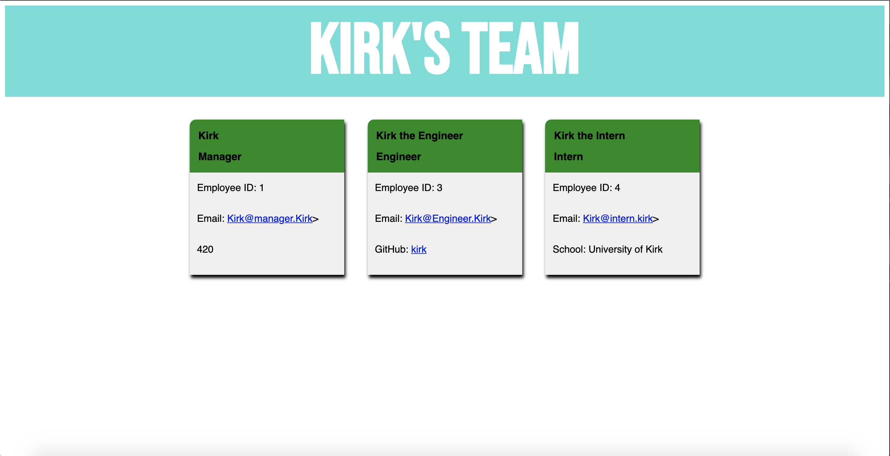
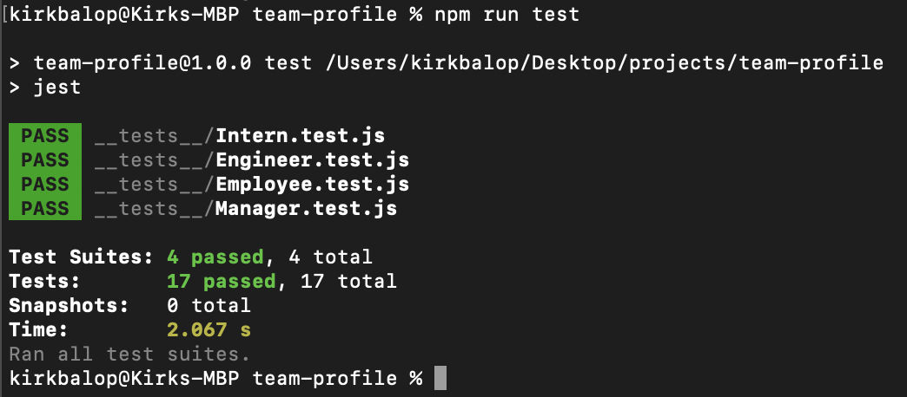

# Team Profile Generator

## Description

This Node application builds an HTML file displaying team information on easy to read cards, all using user input from the command line. The command line prompts the user first to include a manager and then asks if they'd like to include an intern or an engineer and upon completion compiles the HTML.

## Demonstration

## Screenshot 

## Tests

This application was build using class syntax and constructor functions. Tests were run and failed prior to building functions.

## Installation

This application utilizes NPM package 'Inquirer'. Type in the command line prior to use.
